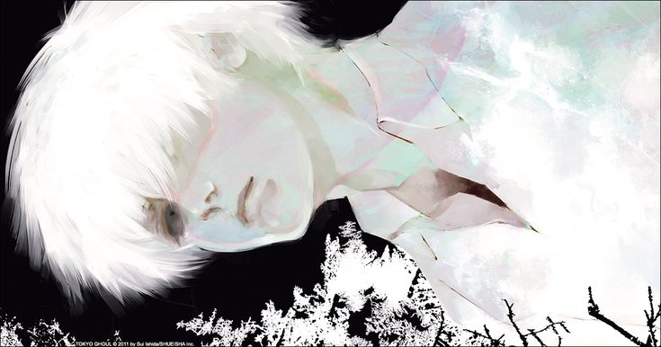
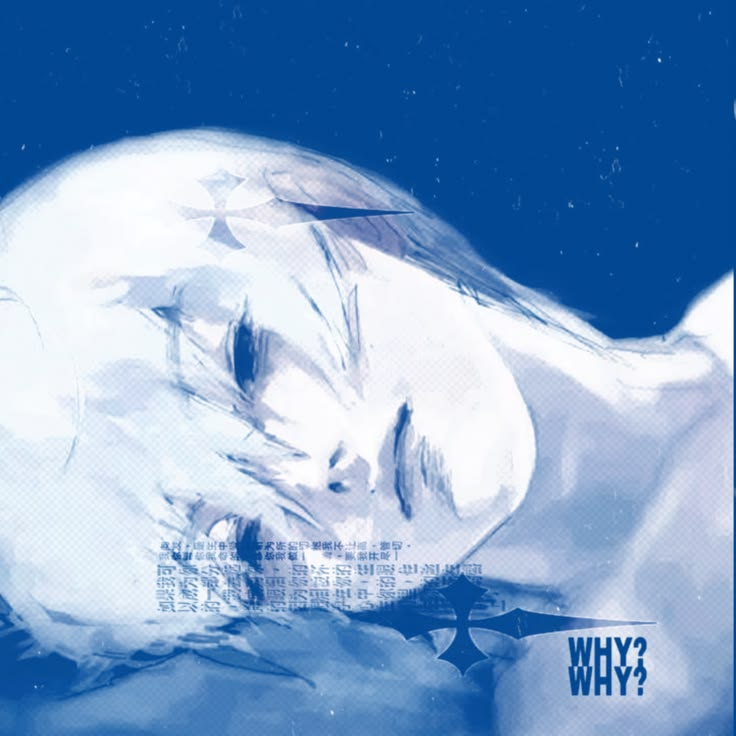

<div align="center">



</div>

<br>

<table>
<tr>

<td width="30%" align="center">



<br><br>

<h2>Genta Permana Utama</h2>

<p><b>Programming Student</b></p>

<p>
💻 Web Developer<br>
🎮 Game Developer<br>
📚 Student
</p>

<p>
<a href="https://github.com/USERNAME">

</a>
</p>

</td>

<td width="70%">

# GENTA

### Programming Student / Game Developer


<br><br>

> "Keep learning, keep creating."

</td>

</tr>
</table>

---

# 👋 About Me

Hello! I'm **Genta Permana Utama**, a programming student
who enjoys learning technology and creating projects.

I'm currently interested in:

- 💻 Web Development
- 🎮 Game Development
- 🧩 Programming
- 🗄️ Database
- 🤖 AI & Technology

I enjoy experimenting with new ideas and turning them
into simple projects.

---

# 🛠️ Skills

### Programming

<p>


</p>

### Database

<p>

</p>

### Tools

<p>


</p>

---

# 🚀 My Projects

<table>
<tr>

<td width="50%">

## 📋 DailyBoard

A simple daily task management web application.

**Features**

- ✅ Task Management
- 🔎 Search
- 🌙 Dark Mode
- 📝 Notes
- 💾 Local Storage
- 🌤️ Weather

</td>

<td width="50%">

## 🎮 Anime Fighter

A 2D anime fighting game project.

**Features**

- ⚔️ Multiple Characters
- 💥 Basic Attack
- 🔥 Ultimate Skill
- ❤️ HP System
- 🏆 Round System
- 🤖 CPU Opponent

</td>

</tr>

<tr>

<td width="50%">

## 🇯🇵 Japanese Learning

A website for learning Japanese.

**Features**

- 📚 Daily Lessons
- ✏️ Writing Practice
- 📝 Daily Notes
- ✅ Progress Tracking
- 💾 Local Storage

</td>

<td width="50%">

## 📚 Library System

A PHP & MySQL library management system.

**Features**

- 📖 Book Management
- 🗂️ Category Management
- 👨‍🎓 Student Data
- 📋 Borrowing Data
- ✏️ Edit & Delete

</td>

</tr>
</table>

---

# 📖 Currently Learning

```text
HTML              ███████████████░░░░░  75%
CSS               ██████████████░░░░░░  70%
JavaScript        █████████████░░░░░░░  65%
TypeScript        ██████████░░░░░░░░░░  50%
PHP               ████████████░░░░░░░░  60%
MySQL             ████████████░░░░░░░░  60%
Game Development  ██████████░░░░░░░░░░  50%
